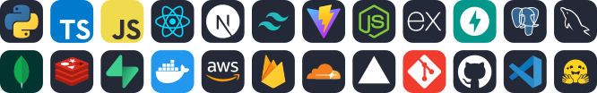
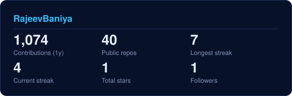
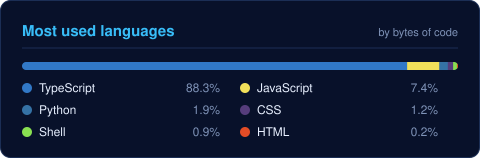

<!-- BANNER - terminal profile.sh --live (additive). Generated by scripts/banner/generate.py.
     ~0.7–0.8 MB each. Cache-bust with ?v=N after regenerating. -->
<picture>
  <source media="(prefers-color-scheme: dark)"  srcset="assets/banner-dark.v9.svg">
  <source media="(prefers-color-scheme: light)" srcset="assets/banner-light.v9.svg">
  
</picture>

 

<!-- NAME / TAGLINE - animated typing -->

 

<!-- SOCIALS -->
&nbsp;&nbsp;
&nbsp;&nbsp;
&nbsp;&nbsp;

 

---

## This is me :)

Hi, I'm **Rajeev**, a Full Stack Developer who enjoys working across both backend systems and frontend interfaces.

- 💻 I mainly work with **JavaScript, TypeScript and Python**: React and Next.js on the frontend, Node.js, Express and FastAPI on the backend.
- 🗄️ Data lives in **PostgreSQL, MySQL, MongoDB and Redis**, and I ship with **AWS, Docker** and CI/CD.
- 🛠️ I build my own projects to learn technologies hands-on rather than just reading about them.
- 🤖 I build AI features end to end: **RAG pipelines, LLM integrations and agent workflows** with LangChain, LangGraph, Hugging Face and vector databases.
- ⚡ I pick up new tools quickly and move across the stack to solve problems.
- 🌐 Portfolio: **[baniyarajeev.com.np](https://baniyarajeev.com.np/)**
 

 

## MY PERFECT STACK

---

## SIGNALS

<table>
<tr>
<td width="50%" align="center" valign="middle">

<!-- Self-rated radar - edit assets/skills.json, the workflow redraws it -->
<picture>
  <source media="(prefers-color-scheme: dark)"  srcset="assets/radar-dark.svg">
  <source media="(prefers-color-scheme: light)" srcset="assets/radar-light.svg">
  
</picture>

</td>
<td width="50%" align="center" valign="middle">

<!-- Hand-authored contract & language stack radar - edit assets/langmix.json -->
<picture>
  <source media="(prefers-color-scheme: dark)"  srcset="assets/radar-langs-dark.svg">
  <source media="(prefers-color-scheme: light)" srcset="assets/radar-langs-light.svg">
  
</picture>

</td>
</tr>
</table>

---

## Numbers matter? ohhh yes. 

<!-- Generated by scripts/cards.py into this repo. Deliberately NOT
     github-readme-stats / streak-stats / github-profile-trophy: those are
     shared public instances that go down and take the whole section with them. -->
<table align="center"><tr>
<td>
<picture>
  <source media="(prefers-color-scheme: dark)"  srcset="assets/card-stats-dark.svg">
  <source media="(prefers-color-scheme: light)" srcset="assets/card-stats-light.svg">
  
</picture>
</td>
<td>
<picture>
  <source media="(prefers-color-scheme: dark)"  srcset="assets/card-langs-dark.svg">
  <source media="(prefers-color-scheme: light)" srcset="assets/card-langs-light.svg">
  
</picture>
</td>
</tr></table>

---

Built with love · @RajeevBaniya

