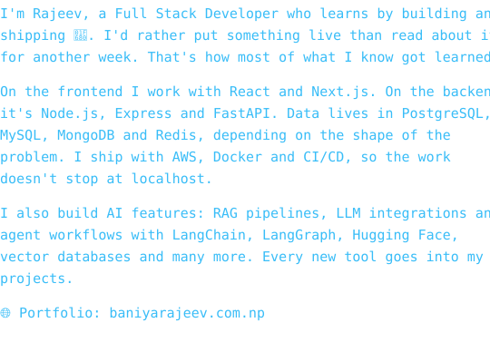

<!-- BANNER - terminal profile.sh --live (additive). Generated by scripts/banner/generate.py.
     ~0.7–0.8 MB each. Cache-bust with ?v=N after regenerating. -->
<picture>
  <source media="(prefers-color-scheme: dark)"  srcset="assets/banner-dark.v9.svg">
  <source media="(prefers-color-scheme: light)" srcset="assets/banner-light.v9.svg">
  
</picture>

 

<!-- NAME / TAGLINE - animated typing -->

 

<!-- SOCIALS -->
&nbsp;&nbsp;
&nbsp;&nbsp;
&nbsp;&nbsp;

 

---

## This is me :)

 

 

## SIGNALS

<!-- Both radars + divider on one navy panel - built by scripts/radar.py then scripts/signals.py
     from assets/skills.json and assets/langmix.json -->
<picture>
  <source media="(prefers-color-scheme: dark)"  srcset="assets/signals-dark.svg">
  <source media="(prefers-color-scheme: light)" srcset="assets/signals-light.svg">
  
</picture>

---

## THE WORK SO FAR

<!-- Generated by scripts/cards.py into this repo. Deliberately NOT
     github-readme-stats / streak-stats / github-profile-trophy: those are
     shared public instances that go down and take the whole section with them. -->
<table align="center"><tr>
<td>
<picture>
  <source media="(prefers-color-scheme: dark)"  srcset="assets/card-stats-dark.svg">
  <source media="(prefers-color-scheme: light)" srcset="assets/card-stats-light.svg">
  
</picture>
</td>
<td>
<picture>
  <source media="(prefers-color-scheme: dark)"  srcset="assets/card-langs-dark.svg">
  <source media="(prefers-color-scheme: light)" srcset="assets/card-langs-light.svg">
  
</picture>
</td>
</tr></table>

---

## MY PERFECT STACK

---

Built with love · @RajeevBaniya

